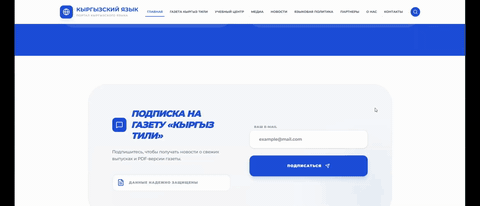
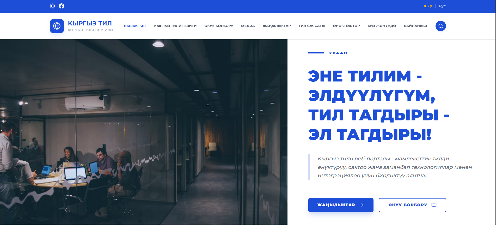
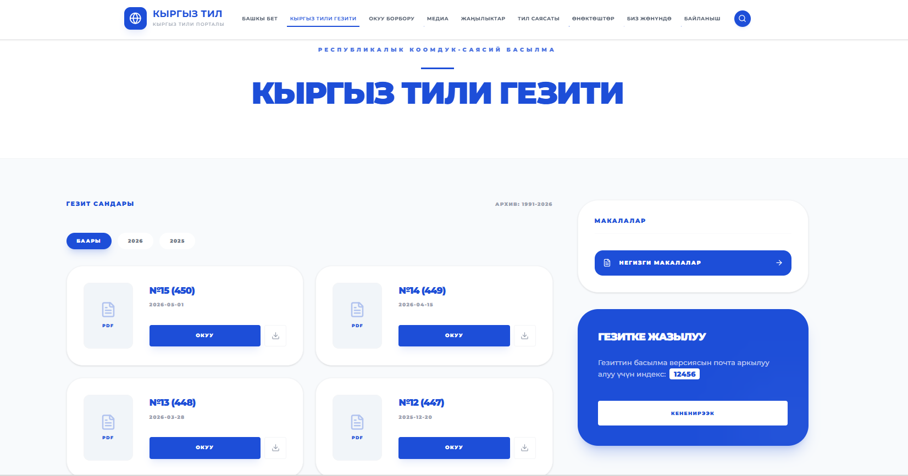
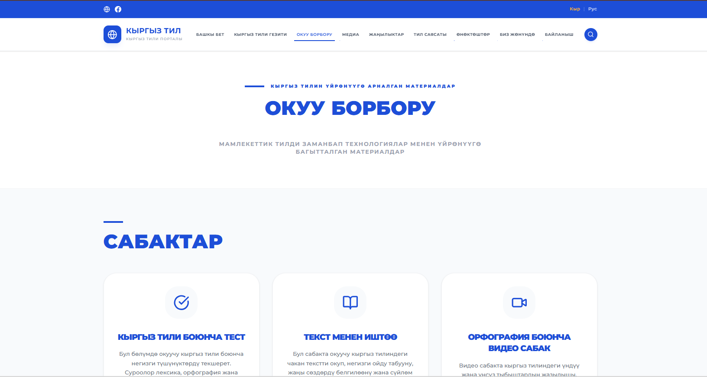
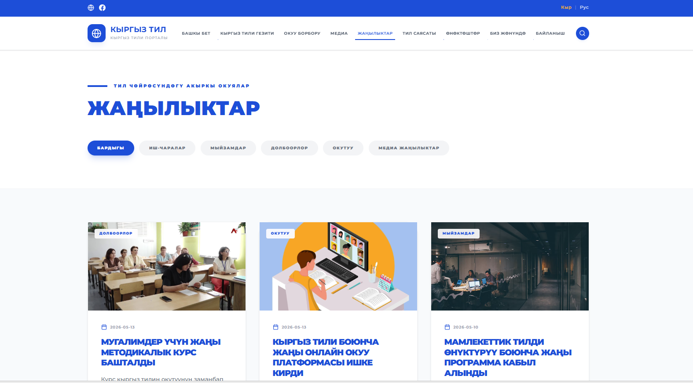

# Kyrgyz Tili — веб-портал кыргызского языка

Многостраничный веб-портал для материалов о кыргызском языке: новости, газета, учебный центр, медиа, подкасты, видео-опросы, партнеры, контакты и CMS-админка для управления контентом.

Проект сделан как полноценное frontend-приложение для портфолио: данные читаются из Firebase Firestore, файлы загружаются в Firebase Storage, интерфейс адаптирован под desktop/tablet/mobile, а админ-панель позволяет редактировать материалы без изменения кода.

## Демо



## Скриншоты

### Главная страница



### Газета



### Учебный центр



### Новости



## Основной функционал

- Главная страница с hero-блоком, быстрыми переходами и последними материалами.
- Раздел газеты с выпусками, PDF, фильтрацией по годам и рубриками статей.
- Учебный центр с уроками, видео-уроками, тестами и методическими материалами.
- Медиа-раздел с подкастами и видео-опросами.
- Detail-страницы для новостей, уроков, подкастов и видео.
- Рабочие кнопки "Поделиться" через Web Share API и fallback-меню с WhatsApp, Telegram, Facebook, X, Email и копированием ссылки.
- Двуязычный интерфейс: кыргызский и русский.
- Админ-панель для управления контентом.
- Загрузка PDF и медиафайлов через Firebase Storage.
- Хранение данных во Firestore.
- Firebase Hosting для публикации сайта.
- Swagger/Express backend оставлен в проекте как дополнительный backend-вариант.

## Технологии

- React
- TypeScript
- Vite
- Redux Toolkit
- Axios
- Tailwind CSS
- React Router
- Firebase Firestore
- Firebase Storage
- Firebase Hosting
- Node.js / Express
- PostgreSQL
- Swagger

## Архитектура

```text
kyrgyz-til/
├── src/
│   ├── components/       # UI и переиспользуемые компоненты
│   ├── features/         # feature-модули: admin, auth, forms, siteSettings
│   ├── modules/          # Redux-модули: news, media, lessons, newspapers
│   ├── pages/            # страницы приложения
│   ├── routes/           # маршрутизация
│   ├── store/            # Redux store
│   ├── translations/     # переводы ky/ru
│   └── lib/              # Firebase, API helpers, utils
├── server/               # Express API, PostgreSQL, Swagger
├── public/readme/        # изображения и GIF для README
├── firebase.json         # Firebase Hosting/Firestore/Storage config
├── firestore.rules       # правила Firestore
├── storage.rules         # правила Firebase Storage
└── package.json
```

## Страницы

- `/` — главная
- `/newspaper` — газета "Кыргыз тили"
- `/learning` — учебный центр
- `/media` — медиа
- `/media/podcast` — подкасты
- `/media/survey` — видео-опросы
- `/news` — новости
- `/language-policy` — языковая политика
- `/partners` — партнеры
- `/about` — о проекте
- `/contact` — контакты
- `/admin` — админ-панель

## Админ-панель

Админ-панель позволяет управлять контентом сайта без участия разработчика:

- создавать, редактировать и удалять новости;
- добавлять выпуски газеты и PDF;
- управлять медиа, подкастами и видео;
- редактировать уроки;
- менять настройки страниц;
- загружать файлы в Firebase Storage.

Идея CMS в проекте: все данные, которые пользователь видит на сайте, должны приходить из хранилища и редактироваться через админку, а не быть зашитыми в компонентах.

## Локальный запуск

Установить зависимости:

```bash
npm install
```

Запустить frontend:

```bash
npm run dev
```

Приложение будет доступно:

```text
http://localhost:3000
```

## Firebase

Публичная часть проекта работает напрямую с Firebase:

- Firestore — данные сайта;
- Storage — PDF, изображения, аудио и другие файлы;
- Hosting — публикация frontend.

Коллекции Firestore:

```text
news
newspapers
media
lessons
siteSettings
subscriptions
contact_messages
```

Деплой правил:

```bash
npx firebase deploy --only firestore:rules,storage
```

Сборка:

```bash
npm run build
```

Деплой сайта:

```bash
npx firebase deploy --only hosting
```

## Backend

В проекте также есть backend на Express + PostgreSQL:

- REST API;
- Swagger UI;
- загрузка файлов;
- PostgreSQL schema/seed.

Backend можно использовать как альтернативу Firebase или как основу для production API.

Запуск:

```bash
npm run dev:api
```

Swagger:

```text
http://localhost:4000/docs
```

## Скрипты

```bash
npm run dev          # запуск frontend
npm run build        # production build
npm run preview      # preview production build
npm run lint         # TypeScript-проверка
npm run dev:api      # запуск Express backend
npm run dev:all      # запуск backend вместе с frontend
npm run sync:hosting # синхронизация данных для hosted-версии
npm run sync:server  # синхронизация данных с server-версией
```

## Что я реализовала в проекте

- Спроектировала структуру многостраничного портала.
- Реализовала адаптивный интерфейс на React + TypeScript.
- Настроила Redux-модули для данных.
- Подключила Firestore как основной источник контента.
- Сделала CMS-подход через админ-панель.
- Добавила загрузку файлов в Firebase Storage.
- Реализовала мультиязычность.
- Настроила Firebase Hosting.
- Добавила backend API со Swagger как расширяемую серверную часть.
- Улучшила UX: lazy-loading страниц, fallback-состояния, фильтры, media players, share-меню.

## Статус

Проект готов для демонстрации в портфолио и может быть расширен до production-версии: закрытые правила Firebase, Firebase Auth для админов, роли пользователей, серверная валидация и CI/CD.
